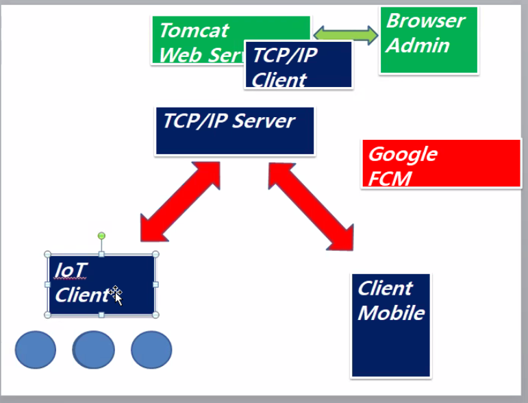

# 네트워크를 이용한 통신




## 준비

> 이클립스 3개 띄우기 Spring, network, network2


## 스프링으로 만들기

> tcpip 서버 담당


> 다 까먹어버렸지 뭐야


### 메이븐 설정

> pom.xml 설정

```java
<project xmlns="http://maven.apache.org/POM/4.0.0" xmlns:xsi="http://www.w3.org/2001/XMLSchema-instance" xsi:schemaLocation="http://maven.apache.org/POM/4.0.0 https://maven.apache.org/xsd/maven-4.0.0.xsd">
  <modelVersion>4.0.0</modelVersion>
  <groupId>tcpip</groupId>
  <artifactId>tcpip</artifactId>
  <version>0.0.1-SNAPSHOT</version>
  <packaging>war</packaging>
   <build>
    <sourceDirectory>src</sourceDirectory>
    <plugins>
      <plugin>
        <artifactId>maven-compiler-plugin</artifactId>
        <version>3.8.1</version>
        <configuration>
          <source>1.8</source>
          <target>1.8</target>
        </configuration>
      </plugin>
      <plugin>
        <artifactId>maven-war-plugin</artifactId>
        <version>3.2.3</version>
        <configuration>
          <warSourceDirectory>web</warSourceDirectory>
        </configuration>
      </plugin>
    </plugins>
  </build>
  
  <properties>
		<java-version>1.8</java-version>
        <org.springframework-version>4.2.5.RELEASE</org.springframework-version>
		<org.aspectj-version>1.6.5</org.aspectj-version>
		<org.slf4j-version>1.7.18</org.slf4j-version>
	</properties>
  <dependencies>
		<!-- Spring -->
		<dependency>
			<groupId>org.springframework</groupId>
			<artifactId>spring-context</artifactId>
			<version>${org.springframework-version}</version>
			<exclusions>
				<!-- Exclude Commons Logging in favor of SLF4j -->
				<exclusion>
					<groupId>commons-logging</groupId>
					<artifactId>commons-logging</artifactId>
				 </exclusion>
			</exclusions>
		</dependency>
		<dependency>
			<groupId>org.springframework</groupId>
			<artifactId>spring-webmvc</artifactId>
			<version>${org.springframework-version}</version>
		</dependency>
				<dependency>
			<groupId>org.springframework</groupId>
			<artifactId>spring-aop</artifactId>
			<version>${org.springframework-version}</version>
		</dependency>
		<dependency>
			<groupId>org.springframework</groupId>
			<artifactId>spring-beans</artifactId>
			<version>${org.springframework-version}</version>
		</dependency>
		<dependency>
			<groupId>org.springframework</groupId>
			<artifactId>spring-core</artifactId>
			<version>${org.springframework-version}</version>
		</dependency>
		<dependency>
			<groupId>org.springframework</groupId>
			<artifactId>spring-expression</artifactId>
			<version>${org.springframework-version}</version>
		</dependency>
		<dependency>
			<groupId>org.springframework</groupId>
			<artifactId>spring-jdbc</artifactId>
			<version>${org.springframework-version}</version>
		</dependency>
		<dependency>
			<groupId>org.springframework</groupId>
			<artifactId>spring-messaging</artifactId>
			<version>${org.springframework-version}</version>
		</dependency>
		<dependency>
			<groupId>org.springframework</groupId>
			<artifactId>spring-tx</artifactId>
			<version>${org.springframework-version}</version>
		</dependency>
		<!-- AspectJ -->
		<dependency>
			<groupId>org.aspectj</groupId>
			<artifactId>aspectjrt</artifactId>
			<version>${org.aspectj-version}</version>
		</dependency>	
		
		
		  <dependency>
			<groupId>org.aspectj</groupId>
			<artifactId>aspectjtools</artifactId>
			<version>${org.aspectj-version}</version>
		 </dependency>
		             
		  <dependency>
			<groupId>org.aspectj</groupId>
			<artifactId>aspectjweaver</artifactId>
			<version>${org.aspectj-version}</version>
		  </dependency>
		
		
		
		
		<!-- Logging -->
		<dependency>
			<groupId>org.slf4j</groupId>
			<artifactId>slf4j-api</artifactId>
			<version>${org.slf4j-version}</version>
		</dependency>
		<dependency>
			<groupId>org.slf4j</groupId>
			<artifactId>jcl-over-slf4j</artifactId>
			<version>${org.slf4j-version}</version>
			<scope>runtime</scope>
		</dependency>
		<dependency>
			<groupId>org.slf4j</groupId>
			<artifactId>slf4j-log4j12</artifactId>
			<version>${org.slf4j-version}</version>
		</dependency>
		<dependency>
			<groupId>log4j</groupId>
			<artifactId>log4j</artifactId>
			<version>1.2.15</version>
			<exclusions>
				<exclusion>
					<groupId>javax.mail</groupId>
					<artifactId>mail</artifactId>
				</exclusion>
				<exclusion>
					<groupId>javax.jms</groupId>
					<artifactId>jms</artifactId>
				</exclusion>
				<exclusion>
					<groupId>com.sun.jdmk</groupId>
					<artifactId>jmxtools</artifactId>
				</exclusion>
				<exclusion>
					<groupId>com.sun.jmx</groupId>
					<artifactId>jmxri</artifactId>
				</exclusion>
			</exclusions>
			<scope>runtime</scope>
		</dependency>

		<!-- @Inject -->
		<dependency>
			<groupId>javax.inject</groupId>
			<artifactId>javax.inject</artifactId>
			<version>1</version>
		</dependency>
				
		<!-- Servlet -->
       <dependency>
            <groupId>javax.servlet</groupId>
            <artifactId>javax.servlet-api</artifactId>
            <version>3.0.1</version>
            <scope>provided</scope>
        </dependency>
        <dependency>
            <groupId>javax.servlet</groupId>
            <artifactId>jstl</artifactId>
            <version>1.2</version>
        </dependency>
		<!-- Tiles3 -->
		<dependency>
            <groupId>org.apache.tiles</groupId>
            <artifactId>tiles-core</artifactId>
            <version>3.0.3</version>
        </dependency>
        <dependency>
            <groupId>org.apache.tiles</groupId>
            <artifactId>tiles-extras</artifactId>
            <version>3.0.3</version>
        </dependency>

		  <!-- MyBatis -->
		 <dependency>
		  <groupId>org.mybatis</groupId>
		  <artifactId>mybatis</artifactId>
		  <version>3.2.3</version>
		 </dependency>
		
		 <dependency>
		  <groupId>org.mybatis</groupId>
		  <artifactId>mybatis-spring</artifactId>
		  <version>1.2.2</version>
		 </dependency>
		 <!-- DBCP -->
		
		 <dependency>
		  <groupId>commons-dbcp</groupId>
		  <artifactId>commons-dbcp</artifactId>
		  <version>1.2.2</version>
		 </dependency>
		<!--  
		 <dependency>
		     <groupId>com.oracle</groupId>
		     <artifactId>ojdbc6</artifactId>
		     <version>11.2.0</version>
		 </dependency>
		 -->
			<!-- AOP Alliance -->
		<!-- Test -->
		<dependency>
			<groupId>junit</groupId>
			<artifactId>junit</artifactId>
			<version>4.7</version>
			<scope>test</scope>
		</dependency>
		<dependency>
			<groupId>commons-fileupload</groupId>
			<artifactId>commons-fileupload</artifactId>
			<version>1.3.1</version>
		</dependency>

		<dependency>
			<groupId>org.springframework</groupId>
			<artifactId>spring-jms</artifactId>
			<version>4.2.5.RELEASE</version>
		</dependency>

		<dependency>
			<groupId>aopalliance</groupId>
			<artifactId>aopalliance</artifactId>
			<version>1.0</version>
		</dependency>
		<dependency>
			<groupId>cglib</groupId>
			<artifactId>cglib</artifactId>
			<version>2.2</version>
		</dependency>
		<!-- json request -->   
		<dependency>
		   <groupId>com.fasterxml.jackson.core</groupId>
		   <artifactId>jackson-databind</artifactId>
		   <version>2.3.3</version>
		  </dependency>     
		 <dependency>
            <groupId>org.codehaus.jackson</groupId>
            <artifactId>jackson-mapper-asl</artifactId>
            <version>1.9.11</version>
        </dependency>
		 <dependency>
		 	<groupId>taglibs</groupId>
		 	<artifactId>standard</artifactId>
		 	<version>1.1.2</version>
		 </dependency>

		<dependency>
			<groupId>com.googlecode.json-simple</groupId>
			<artifactId>json-simple</artifactId>
			<version>1.1</version>
  		</dependency>
	</dependencies>
</project>

```


메이븐 프로젝트로 변경 누른 후, 위의 코드를 복사한다. 알아서 다운로드 해준다.


### Spring 설정

> web.xml 및 web > WEB-INF > config > spring.xml 설정


`spring.xml` 설정

```xml
	<!-- ViewResolver -->
	<bean id="viewResolver"
		class="org.springframework.web.servlet.view.InternalResourceViewResolver">
		<property name="prefix" value="/view/" />
		<property name="suffix" value=".jsp" />
		<property name="order" value="0" />
	</bean>
	<!-- File Upload -->
	<bean id="multipartResolver"
		class="org.springframework.web.multipart.commons.CommonsMultipartResolver">
		<property name="maxUploadSize" value="500000000" />
	</bean>


```


`web.xml`

```xml
	<!-- Spring Dispatcher -->
	<servlet>
		<servlet-name>action</servlet-name>
		<servlet-class>org.springframework.web.servlet.DispatcherServlet</servlet-class>
		<init-param>
			<param-name>contextConfigLocation</param-name>
			<param-value>/WEB-INF/config/spring.xml</param-value>
		</init-param>
	</servlet>

	<servlet-mapping>
		<servlet-name>action</servlet-name>
		<url-pattern>*.mc</url-pattern>
	</servlet-mapping>

	<!-- Encoding Filter -->
	<filter>
		<filter-name>enc</filter-name>
		<filter-class>org.springframework.web.filter.CharacterEncodingFilter</filter-class>
		<init-param>
			<param-name>encoding</param-name>
			<param-value>EUC-KR</param-value>
		</init-param>
	</filter>
	<filter-mapping>
		<filter-name>enc</filter-name>
		<url-pattern>/*</url-pattern>
	</filter-mapping>
```


## 전체적인 구조

> index.html -> main.mc -> main.jsp


**우리는 페이지 이동 없이 요청만 할 것임**


웹페이지에서 요청하면 IoT 또는 Mobile에서 작동.

